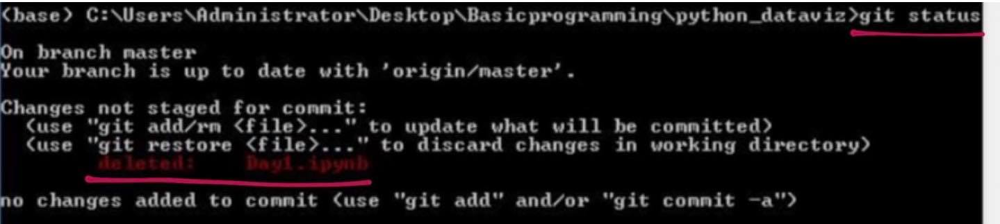
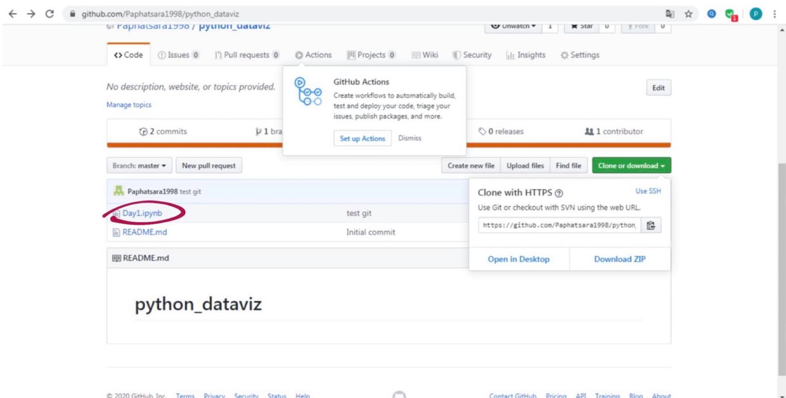

# python_dataviz
<h1>การบ้าน 1</h1>

### นางสาวปนัดดา เกษอรุณศรี 603021870-6
#### คณะวิทยาศาสตร์  สาขาสารสนเทศสถิติ
***
# Materail 
  - วิธีการลงโปรแกรม Anaconda
  - วิธีการเข้าใช้งาน  Google Colab
  - วิธีการใช้งาน    Github
***
## 1. วิธีการลงโปรแกรม Anacon 
___
มีขั้นตอนดังนี้
  * เข้า Google แล้ว search " Miniconda " แล้วกด downloads
 
  
   
     กด downloads python 3.7 โดยเลือกจำนวน bit ตามคอมพิวเตอร์ โดยการดูจำนวณ bit ดังนี้
    
    โดยดูจำนวน bitของเครื่องคอมพิวเตอร์ที่ system type
   

* ติดตั้งโปรแกรมโดยการ กดที่ปุ่ม Run และกดปุ่ม next ไปจนถึงคำว่า finish 
(Run > next > finish)
   
    
     

* ตรวจสอบว่าลงโปรแกรมสำเร็จไหม 
   โดย 1.เปิดโปรแกรม Anconda 
       2.พิมพ์คำว่า " Python" ถ้าโปรแกรมสามารถลงได้สำเร็จ มันจะบอกว่า ลงเวอร์ชั่นอะไร เช่น python 3.7.3
      
     

* พิมพ์คำว่า print('ข้อความ') เพื่อ ทดสอบโปรแกรม ถ้าโปรแกรมใช้ได้ จะแสดงผลออกมา
   

* การออกจากโปรแกรม  โดยไม่ต้องปิดหน้าต่าง ใช้ออกเมื่อต้องการเริ่มใหม่ ทำได้โดย พิมพ์ exit()   กรณีต้องการปิดโปรแกรมออกไปเลย ให้กด ctrl + c

* ขั้นตอนการ Install matplotlib anaconda มีขั้นตอนดังนี้
1.พิมพ์ conda install matplotlib ซึ่งเป็นคำสั่งในการ install > เมื่อผลรันเสร็จ จะขึ้นข้อความ ([y]/n)? ให้กด y แสดงว่า yes แปลว่าตกลง

*ขั้นตอนการ Install jupyter notebook ทำ

 พิมพ์คำว่าjupyter notebook แล้วหน้าจอจะปรากฎขึ้นมา
 
 หน้าจอจะปรากฎขึ้น
 

___
## 2. วิธีการเข้าใช้งาน Google Colab
___
มีขั้นตอนดังนี้

* เข้า Google แล้ว search "Colab" แล้วเข้า email ใน google chome

* กด New python 3 notebook เพื่อสร้างหน้าใหม่

* เมื่อต้องการเซฟ ให้กด ที่ file > save 

*ถ้าอยากตกแต่ง ก็สามารถตกแต่งได้ที่ setting 

___
## 3. วิธีการใช้งาน    Github
___
มีขั้นตอนดังนี้
 
 * สร้าง account

จะมีข้อความส่งไปที่ gmail และให้ทำการเปิดเป็นสาธารณะ 

* ขั้นตอนการ install github 
  โดยทำการ พิมพ์ conda install  -c anaconda git
  
  

* จากนั้น เปิด github ขึ้น เพื่อลิงค์ กับเว็บไซต์
   กดที่ปุ่ม clone or download แล้วกด copy url
  
   

* จากนั้นทำการ git clone เพื่อเชื่อม code ในเครื่องคอมพิวเตอร์ กับ อินเทอร์เน็ตเข้าด้วยกัน

 พิมพ์ dir เพื่อดูว่ามีไฟล์อะไรบ้าง
 
 จากนั้น พิมพ์ cd และ python_dataviz

 * จากนั้นทำ git status เพื่อดูว่าอันไหนยังไม่เชื่อม
 

 * จากนั้นทำ git add เพื่อ add สู่ Internet โดยพิมพ์ git aad ชื่อไฟล์
 

* ทำการ git commit -m " " เพื่อบอกว่าเรื่องที่ทำเกี่ยวกับอะไร

* สุดท้าย ทำการ git push เพื่อทำการส่งข้อมูลสู่อินเทอร์เน็ต  อย่าลืมใส่ username และ password 

     

  

    

